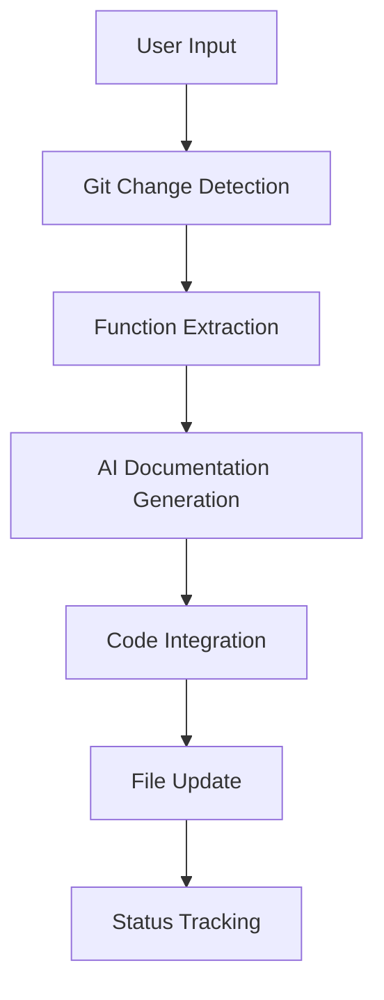

# Phoenix Architecture Documentation 🏗️

This document provides a comprehensive overview of Phoenix's architecture, design patterns, and component relationships.

## 📋 Table of Contents

- [System Overview](#system-overview)
- [Core Components](#core-components)
- [Data Flow](#data-flow)
- [Design Patterns](#design-patterns)
- [Module Dependencies](#module-dependencies)
- [Extension Points](#extension-points)

## 🌐 System Overview

Phoenix is designed as a modular, extensible system for automated C++ code documentation. The architecture follows a **layered approach** with clear separation of concerns:

```
┌─────────────────────────────────────────┐
│              User Interface             │ ← GUI Layer (DearPyGUI)
├─────────────────────────────────────────┤
│           Application Layer             │ ← Orchestration & Workflow
├─────────────────────────────────────────┤
│            Service Layer                │ ← AI, Git, File Processing
├─────────────────────────────────────────┤
│             Core Layer                  │ ← Parsing, Analysis
├─────────────────────────────────────────┤
│          Infrastructure                 │ ← I/O, Configuration
└─────────────────────────────────────────┘
```

## 🧩 Core Components

### 1. **Parser Engine** (`CppParser`)

**Purpose**: C++ code parsing using tree-sitter technology

**Responsibilities**:
- Parse C++ source code into Abstract Syntax Trees (AST)
- Extract function definitions and metadata
- Handle various C++ constructs (templates, namespaces, etc.)

**Key Methods**:
```python
class CppParser:
    def __init__(self)              # Initialize tree-sitter parser
    def ParseContent(content)       # Parse bytes into AST
    def FindFunctionNode(tree, line) # Find function at specific line
    def GetFullFunctionName(node)   # Extract function name
```

**Architecture Pattern**: **Factory Pattern** for parser creation

---

### 2. **AI Documentation Engine** (`CustomOllamaGenerator`)

**Purpose**: Generate documentation using AI models

**Responsibilities**:
- Interface with Ollama AI models via HTTP API
- Generate Doxygen-style comments
- Create inline code comments
- Perform code quality analysis

**Key Features**:
- **Connection Management**: Robust connection handling with retries
- **Prompt Engineering**: Optimized prompts for C++ documentation
- **Error Recovery**: Graceful handling of AI service failures

```python
class CustomOllamaGenerator:
    def GenerateDoc(func_text)         # Generate Doxygen comments
    def GenerateCodeComment(func_text) # Generate inline comments  
    def GenerateCodeReviewLog(...)     # Generate code review
```

**Architecture Pattern**: **Adapter Pattern** for AI service abstraction

---

### 3. **Version Control Handler** (`GitRepoHandler`)

**Purpose**: Git repository integration and change detection

**Responsibilities**:
- Detect file changes between commits
- Retrieve file content from different commits
- Handle branches and working directory changes

**Key Capabilities**:
- **Change Detection**: Smart identification of modified functions
- **Content Retrieval**: Access to historical file versions
- **Branch Management**: Work with different Git branches

```python
class GitRepoHandler:
    def GetDiffNameStatus(old_ref)     # Get changed files
    def GetOldContent(path, ref)       # Get historical content
    def GetNewContent(path)            # Get current content
```

**Architecture Pattern**: **Facade Pattern** for Git operations

---

### 4. **File Processing Engine** (`FileProcessor`)

**Purpose**: File I/O and encoding management

**Responsibilities**:
- Handle multiple text encodings
- Process files in batch mode
- Manage file status and resumption

**Features**:
- **Encoding Detection**: Automatic detection of file encodings
- **Batch Processing**: Efficient handling of multiple files
- **Status Tracking**: Resume interrupted processing

---

### 5. **GUI Controller** (DearPyGUI Integration)

**Purpose**: User interface and interaction management

**Responsibilities**:
- Provide intuitive interface for configuration
- Real-time progress feedback
- Thread management for non-blocking operations

**Components**:
- **Configuration Panel**: Settings and options
- **Progress Display**: Real-time logging and status
- **Control Interface**: Start, stop, and configuration actions

## 🔄 Data Flow

### Primary Documentation Workflow



### Detailed Flow Steps

1. **Input Processing**
   - User selects repository path and date range
   - System validates configuration

2. **Change Detection**
   - Git handler identifies changed files
   - Function extractor finds modified functions

3. **AI Processing**
   - Generate Doxygen documentation
   - Create inline comments
   - Perform code quality analysis

4. **Integration**
   - Insert generated documentation
   - Preserve existing code structure
   - Update file with new comments

5. **Status Management**
   - Track processing status
   - Enable resumption of interrupted tasks

## 🎨 Design Patterns

### 1. **Strategy Pattern**
- **Context**: Different AI models and services
- **Implementation**: Swappable AI generators
- **Benefit**: Easy addition of new AI providers

### 2. **Factory Pattern**
- **Context**: Parser and component creation
- **Implementation**: Centralized object creation
- **Benefit**: Consistent initialization and configuration

### 3. **Observer Pattern**
- **Context**: GUI updates and progress tracking
- **Implementation**: Event-driven UI updates
- **Benefit**: Responsive user interface

### 4. **Template Method Pattern**
- **Context**: File processing workflow
- **Implementation**: Abstract processing steps
- **Benefit**: Consistent processing while allowing customization

### 5. **Adapter Pattern**
- **Context**: External service integration
- **Implementation**: Uniform interfaces for different services
- **Benefit**: Service interchangeability

## 📦 Module Dependencies

### Dependency Graph

```
auto_comment_cpp_code.py (Main GUI)
├── get_git_changes.py (Git Analysis)
├── extract_function_code_2.py (Function Extraction)
├── generate_docs_ollama.py (Batch Processing)
└── External Dependencies
    ├── tree-sitter (Parsing)
    ├── requests (HTTP API)
    ├── dearpygui (GUI)
    └── ollama (AI Models)
```

### Dependency Levels

**Level 1 - Infrastructure**
- Operating System APIs
- Python Standard Library
- File System Access

**Level 2 - External Libraries**
- tree-sitter for parsing
- requests for HTTP
- dearpygui for GUI
- ollama for AI integration

**Level 3 - Core Modules**
- CppParser (parsing logic)
- GitRepoHandler (version control)
- File I/O handlers

**Level 4 - Service Layer**
- AI documentation generation
- Batch processing management
- Status tracking

**Level 5 - Application Layer**
- GUI orchestration
- Workflow management
- User interaction

## 🔌 Extension Points

### 1. **AI Model Integration**

**Current**: Ollama HTTP API
**Extension Point**: `AIGeneratorInterface`

```python
class AIGeneratorInterface:
    def generate_documentation(self, code: str) -> str:
        pass
    
    def generate_inline_comments(self, code: str) -> List[Comment]:
        pass
```

**Potential Integrations**:
- OpenAI GPT models
- Claude API
- Local transformer models
- Custom fine-tuned models

### 2. **Language Support**

**Current**: C++ via tree-sitter-cpp
**Extension Point**: `LanguageParser`

```python
class LanguageParser:
    def parse_code(self, content: bytes) -> Tree:
        pass
    
    def extract_functions(self, tree: Tree) -> List[Function]:
        pass
```

**Potential Languages**:
- Java (tree-sitter-java)
- Python (tree-sitter-python)
- Rust (tree-sitter-rust)
- Go (tree-sitter-go)

### 3. **Version Control Systems**

**Current**: Git integration
**Extension Point**: `VCSHandler`

```python
class VCSHandler:
    def get_changes(self, since: str) -> List[Change]:
        pass
    
    def get_file_content(self, path: str, revision: str) -> str:
        pass
```

**Potential VCS**:
- Subversion (SVN)
- Mercurial
- Perforce
- Bazaar

### 4. **Output Formats**

**Current**: Doxygen-style comments
**Extension Point**: `DocumentationFormatter`

```python
class DocumentationFormatter:
    def format_function_doc(self, func_info: FunctionInfo) -> str:
        pass
    
    def format_inline_comment(self, comment: str) -> str:
        pass
```

**Potential Formats**:
- JavaDoc style
- Sphinx documentation
- Markdown documentation
- Custom XML formats

## 🚀 Performance Considerations

### 1. **Memory Management**
- **Streaming Processing**: Large files processed in chunks
- **AST Caching**: Reuse parsed trees when possible
- **Garbage Collection**: Explicit cleanup of large objects

### 2. **Concurrency**
- **Threading**: GUI operations on separate thread
- **Async I/O**: Non-blocking file operations
- **Batch Processing**: Parallel processing of independent files

### 3. **Caching Strategies**
- **Function Cache**: Cache extracted function metadata
- **Git Content Cache**: Cache file contents during processing
- **AI Response Cache**: Cache similar function documentations

## 🔒 Security Considerations

### 1. **Input Validation**
- **Path Validation**: Prevent directory traversal attacks
- **Command Injection**: Safe Git command construction
- **Content Sanitization**: Clean user inputs

### 2. **AI API Security**
- **Request Validation**: Validate AI API responses
- **Rate Limiting**: Respect API rate limits
- **Error Handling**: Safe handling of API failures

### 3. **File Access**
- **Permission Checks**: Verify file read/write permissions
- **Backup Creation**: Create backups before modification
- **Atomic Operations**: Ensure file consistency

## 🧪 Testing Architecture

### 1. **Unit Testing**
- **Parser Tests**: Verify AST generation and function extraction
- **AI Generator Tests**: Mock AI responses for consistent testing
- **Git Handler Tests**: Test change detection with mock repositories

### 2. **Integration Testing**
- **Workflow Tests**: End-to-end processing verification
- **Service Integration**: Test external service interactions
- **File Processing**: Verify file modification accuracy

### 3. **UI Testing**
- **GUI Component Tests**: Verify interface functionality
- **User Interaction Tests**: Test complete user workflows
- **Configuration Tests**: Verify settings persistence

---

This architecture supports Phoenix's goals of being **maintainable**, **extensible**, and **reliable** while providing a **smooth user experience** for C++ documentation automation.